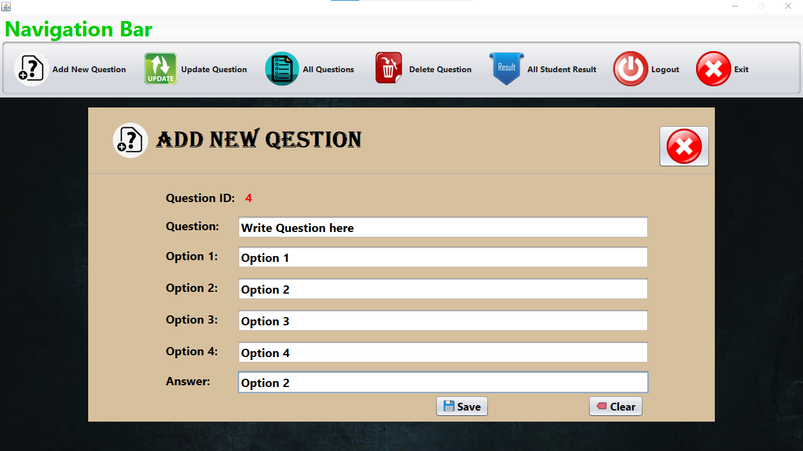

# Quiz Management System

This project is a Quiz Management System built using Java and MySQL in NetBeans IDE. It allows students to take quizzes and receive scores, while administrators can manage quiz content and view results.

## Features

- **Student Functionality:**
  - Sign up and log in to access quizzes.
  - Attempt quizzes and receive scores.

- **Admin Functionality:**
  - Add, update, and delete quiz questions.
  - View results for all students.

## Getting Started

### Prerequisites

- **Java Development Kit (JDK)**
- **NetBeans IDE**
- **MySQL Server**

### Installation

1. **Clone the Repository:**

   ```bash
   git clone https://github.com/68rajat68/quiz-management-system.git

2. **Open in NetBeans:**

   - Launch NetBeans IDE.
   - Go to `File > Open Project`.
   - Select the cloned repository folder.

3. **Run the Application:**

   - In NetBeans, right-click the project and select `Run`.

## Usage

1. **Student:**

   - Sign up to create an account.
   - Log in to access available quizzes.
   - Submit answers and view scores upon completion.

2. **Admin:**

   - Log in with admin credentials.
   - Manage quizzes by adding, updating, or deleting questions.
   - View student results and performance.

## Screenshots





For more information, please visit the [GitHub Repository](https://github.com/68rajat68/quiz-management-system).

